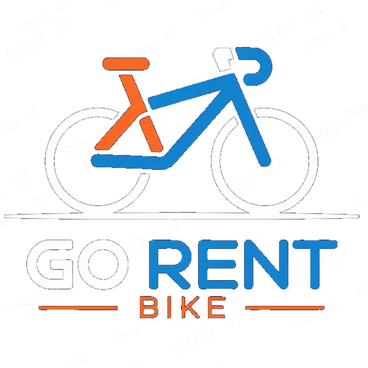

    

<h1 align="center">Go Rent Bike Web</h1>

    Plataforma web para la gestión y alquiler online de bicicletas y accesorios.

## 🚴‍♂️ Sobre el proyecto

**Go Rent Bike** es una aplicación diseñada para digitalizar el proceso de alquiler de bicicletas, permitiendo a los clientes realizar reservas online y ofreciendo a la empresa herramientas internas de gestión.

El proyecto está desarrollado con Laravel, utilizando la arquitectura MVC (Modelo–Vista–Controlador) para organizar la lógica del sistema de forma modular y escalable. Las interfaces se construyen con Blade, el motor de plantillas de Laravel, que permite generar vistas dinámicas y reutilizables.

La aplicación utiliza MySQL como base de datos para gestionar bicicletas, reservas, usuarios, mantenimientos y demás información del sistema.
En el frontend se emplean HTML5, CSS3, JavaScript y Font Awesome.

## 📚 Documentación
Toda la documentación del proyecto está disponible en GitHub Pages:

👉 [Visitar documentación en GitHub Pages](https://ti7euf.github.io/GoRentBike/)

## 🤝 Contribuir
Las contribuciones son bienvenidas.
Puedes abrir issues o enviar pull requests para mejoras, correcciones o nuevas funcionalidades.

## 🔒 Seguridad
Si encuentras alguna vulnerabilidad, por favor contacta con el desarrollador del proyecto para que pueda ser corregida lo antes posible.

## 📄 Autores
- Pablo Fernández Escarabajal