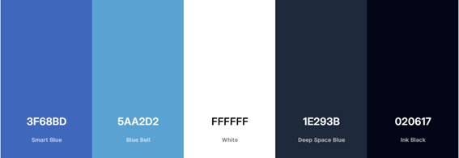
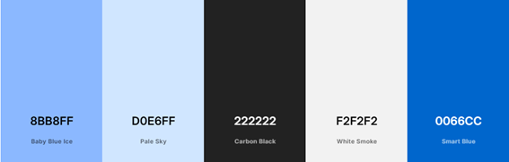
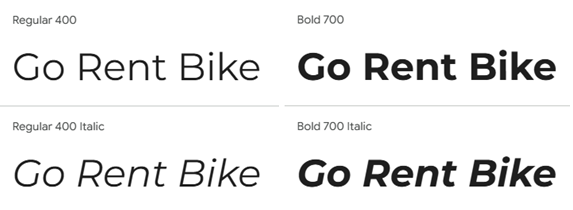
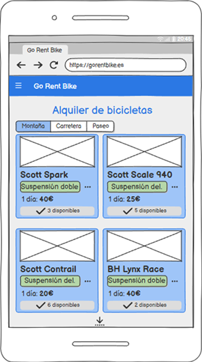
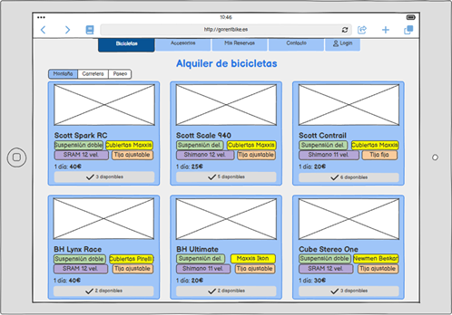
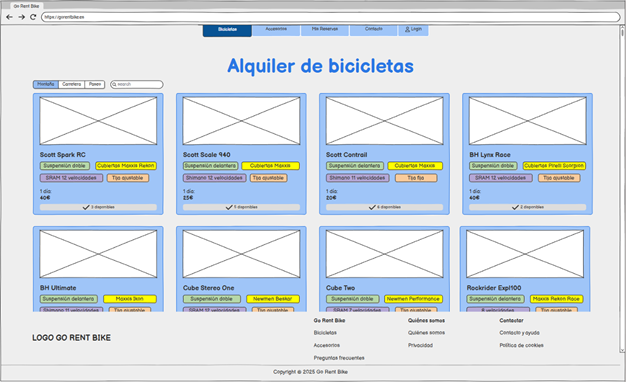
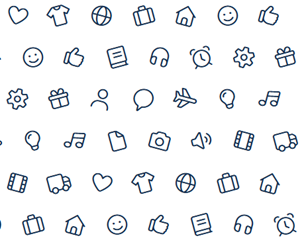

# Guía de Estilos

## Introducción

Este documento recoge las reglas y recomendaciones de diseño que se deben seguir durante el desarrollo del proyecto. Sirve para que todos los elementos de la web mantengan un estilo coherente y se vea uniforme en todas las páginas.

**Objetivo**: Definir de manera sencilla las pautas de diseño para que la web tenga un aspecto consistente y agradable para el usuario.

## Identidad Visual

### Logo

Se proporcionan dos versiones de logotipo para garantizar una buena visibilidad en distintos escenarios.

**Logo a color** (para fondos oscuros):

- Colores usados: Azul `#1582CE` · Naranja `#FC6827`
- Pensado para usarse sobre fondos oscuros
- No usar sobre:
  - Fondo azul similar a `#1582CE`
  - Fondo naranja similar a `#FC6827`
  - Fondo claro que reduce el contraste

**Logo en negro** (para fondos claros):

- Color usado: Negro `#000000`
- Pensado para usarse sobre fondos claros o blancos
- No usar sobre:
  - Fondo oscuro
  - Fondo con poco contraste

### Paleta de Colores

El proyecto incluye dos modos de visualización: tema oscuro y tema claro, para que el usuario pueda elegir el que le resulte más cómodo.

Cada modo tiene su propia paleta de colores, pero ambas mantienen la misma línea visual basada en tonos azules. Lo que cambia principalmente es el contraste, los fondos y cómo se distribuyen los colores para que todo se vea claro y fácil de leer.

**Tema oscuro** (por defecto): utiliza fondos oscuros y superficies más profundas para dar un estilo moderno y con más sensación de profundidad.

| Código | Nombre |
|--------|--------|
| `#3F68BD` | Smart Blue |
| `#5AA2D2` | Blue Bell |
| `#FFFFFF` | White |
| `#1E293B` | Deep Space Blue |
| `#020617` | Ink Black |

**Tema claro**: usa fondos más luminosos y contrastes suaves para ofrecer una apariencia más limpia y ligera.

| Código | Nombre |
|--------|--------|
| `#8BB8FF` | Baby Blue Ice |
| `#D0E6FF` | Pale Sky |
| `#222222` | Carbon Black |
| `#F2F2F2` | White Smoke |
| `#0066CC` | Smart Blue |

## Tipografía

Se decide utilizar una letra sans serif porque ofrece una lectura clara, moderna y cómoda. Este estilo tipográfico transmite sencillez y cercanía, sin elementos decorativos que distraigan.

Más concretamente, se elige **Montserrat** porque tiene un aspecto actual y equilibrado, con formas redondeadas que encaja muy bien con el mundo de la movilidad y las bicicletas. Además, funciona muy bien en distintos tamaños, lo que ayuda a mantener una apariencia limpia en toda la web.

### Tamaños y jerarquías

| Elemento | Tamaño | Px |
|----------|--------|----|
| **h1** | 2.4rem | 38.4px |
| **h2** | 2rem | 32px |
| **h3** | 1.25rem | 20px |
| **h4** | 1rem | 16px |
| **p, li, span, label** | 1rem | 16px |
| **small, .footer .copyright** | 0.85rem | 13.6px |

### Muestras

## Prototipo

Versión móvil:

Versión tablet:

Versión escritorio:

## Grid y Layout

El diseño se organiza en un grid principal de tres filas: menú de navegación, contenido y pie de página. Esta estructura se mantiene en todas las páginas del sitio.

En escritorio y tablet, el menú de navegación se muestra con los enlaces visibles en la parte superior. En versión móvil, el menú se adapta para ahorrar espacio y se presenta mediante un "menú hamburguesa", permitiendo al usuario abrir y cerrar la navegación cuando lo necesite.

El proyecto sigue una estrategia **mobile first**, por lo que los estilos base se definen para pantallas pequeñas. A partir de ahí, se utilizan media queries con `min-width` para ir añadiendo ajustes y mejoras en tablet y escritorio conforme aumenta el tamaño de la pantalla.

| Dispositivo | Punto de ruptura |
|-------------|------------------|
| Móvil | < 769 px |
| Tablet | >= 769 px |
| Escritorio | >= 1025 px |

## Iconografía

Para la iconografía del proyecto se utilizará FontAwesome, ya que ofrece un catálogo amplio, consistente y fácilmente escalable. Sus iconos encajan con la línea visual de la página y permiten mantener una estética uniforme en todos los elementos interactivos. Además, su integración sencilla facilita aplicar el mismo estilo tipográfico y de color que se utiliza en el resto del diseño.

## Demostración

### Móvil

En la versión móvil, la barra de navegación contiene, en el lado izquierdo, el botón para desplegar el menú oculto y, en el lado derecho, el logo. El contenido es un grid de una sola columna para poder visualizar correctamente cada tarjeta. El pie de página se distribuye también en una sola columna.

### Tablet

En la versión Tablet, la barra de navegación ya no es oculta, el contenido se muestra en 3 columnas y el pie de página se divide en 2 columnas.

### Escritorio

En la versión de escritorio, la barra de navegación se mantiene idéntica a la versión Tablet, el contenido ahora se muestra en un grid de 4 columnas y el pie de página en otras 4 columnas.

## Menú de navegación

El menú de navegación se adapta según el dispositivo.

En móvil, se muestra en formato hamburguesa. Al pulsar el botón, se despliega un menú vertical con las distintas opciones. También incluye una sección de usuario que cambia dependiendo de si ha iniciado sesión.

En tablet y escritorio, el menú se muestra de forma horizontal con las opciones visibles. Además, el usuario dispone de un menú desplegable con opciones adicionales como perfil o cerrar sesión.

El menú utiliza iconos para facilitar la navegación y mantiene los estilos definidos en el tema claro y oscuro.

El menú se adapta mediante media queries basadas en los puntos de ruptura definidos en el diseño responsive.

[⬅ Volver al índice](index.md)
