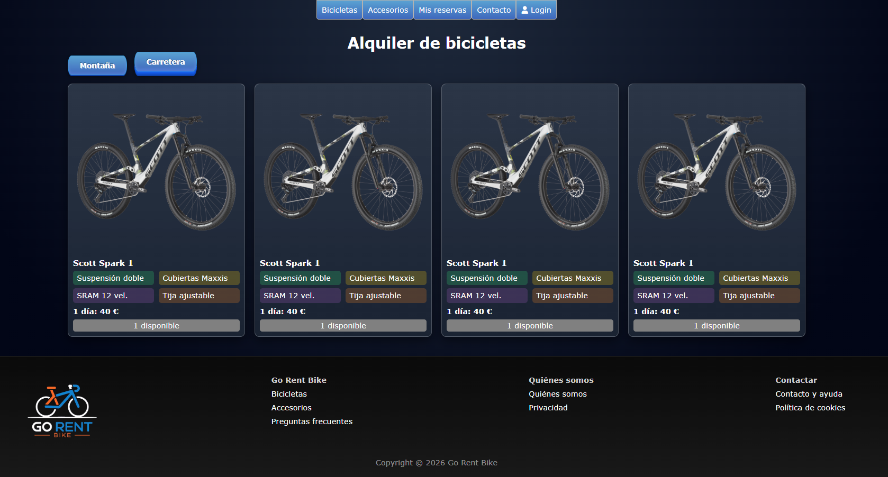
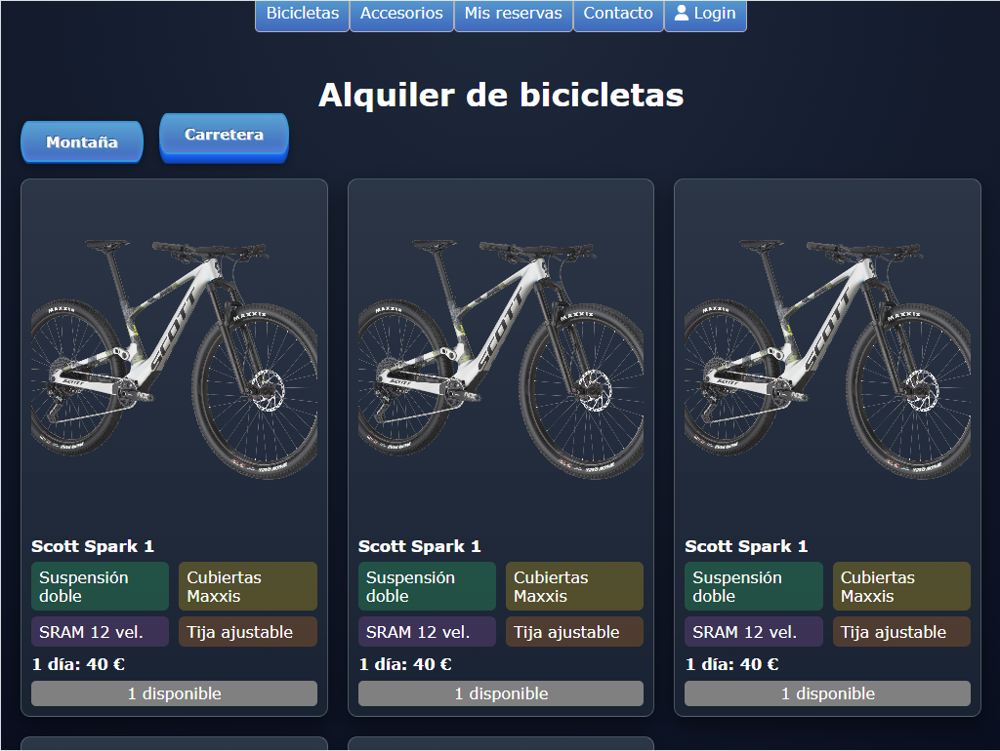
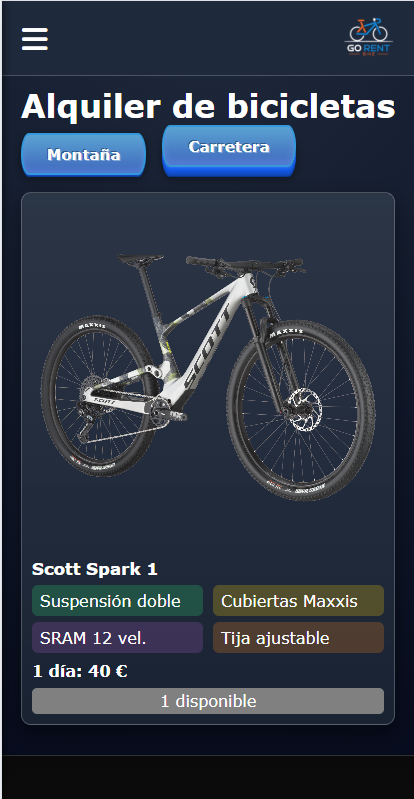

# Uso del Proyecto

## Funcionalidades para clientes

- Consultar catálogo de bicicletas y accesorios  
- Ver disponibilidad  
- Realizar reservas  
- Consultar reservas activas o pasadas  

## Funcionalidades para empleados

### Empleado técnico
- Registrar mantenimientos  
- Consultar historial de mantenimientos  

### Empleado de facturación
- Consultar ingresos/gastos  

### Administrador
- Gestionar bicicletas y accesorios
- Modificar precios
- Gestionar usuarios internos
- Supervisar reservas

## Navegación prevista

1. **Bicicletas**  
2. **Accesorios**  
3. **Mis reservas**  
4. **Contacto**  
5. **Mantenimientos**  
6. **Facturación**  
7. **Gestión de bicicletas**
8. **Gestión de usuarios**

## Capturas

Versión de escritorio:

Versión tablet:

Versión móvil:

[⬅ Volver al índice](index.md)